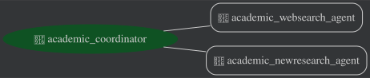

# Academic Research Agent

## Project Structure

This project is organized into two main components:
- **`backend/`**: Contains the AI-driven research agent core, implemented using the Google Agent Development Kit (ADK).
- **`frontend/`**: A React-based web interface for interacting with the agent.

---

## Overview

The Academic Research Agent is an AI-driven tool designed to simplify the exploration of recent academic literature surrounding seminal research. Navigating the vast amount of studies citing foundational works can be overwhelming; this agent provides a streamlined way to analyze a seminal paper and its contemporary influence.

By inputting a seminal research paper (as a PDF), the agent:
1.  **Analyzes core contributions**: Identifies the key innovations and findings of the original work.
2.  **Maps modern influence**: Uses Google Search to retrieve and analyze recent publications that cite the seminal paper.
3.  **Proposes future directions**: Synthesizes findings to suggest promising avenues for novel research.

### Core ADK Implementation
This POC demonstrates the fundamental concepts of the Google Agent Development Kit (ADK):

*   **Multi-agent Orchestration**: Implements the `transfer-to-agent` pattern for dynamic task delegation between specialized sub-agents.
*   **Dynamic Tool Integration**: Orchestrates built-in tools (Google Search) and custom agent-to-agent handoffs for complex research workflows.
*   **Managed Evaluation**: Features an automated evaluation pipeline using `AgentEvaluator` with LLM-as-a-judge for semantic quality checks.
*   **Production Deployment**: Integrated deployment flow for Vertex AI Agent Engine with session and user management.

---

### Architecture
The agent is built using the Google Agent Development Kit (ADK) and follows a multi-agent orchestration pattern.



---

## Backend Setup

### Prerequisites
*   **Python 3.10+**
*   **[uv](https://docs.astral.sh/uv/)**: For dependency management.
*   **Google Cloud CLI**: [Installation Guide](https://cloud.google.com/sdk/docs/install)
*   A Google Cloud Platform project with Vertex AI enabled.

### Installation
```bash
cd backend
uv sync
```

### Configuration
Set up your Google Cloud environment variables in a `backend/.env` file:
```bash
GOOGLE_GENAI_USE_VERTEXAI=true
GOOGLE_CLOUD_PROJECT=<your-project-id>
GOOGLE_CLOUD_LOCATION=<region> # e.g., us-central1
GOOGLE_CLOUD_STORAGE_BUCKET=<your-bucket> # Required for Agent Engine deployment
```

Authenticate your GCloud account:
```bash
gcloud auth application-default login
gcloud auth application-default set-quota-project $GOOGLE_CLOUD_PROJECT
```

---

## Frontend Setup

### Installation
```bash
cd frontend
npm install
```

### Running the Frontend
```bash
cd frontend
npm run dev
```

---

## Running the Agent (Backend)

You can interact with the agent via CLI or a local web interface using `adk`.

**CLI Mode:**
```bash
cd backend
uv run adk run academic_research
```

**Web Interface:**
```bash
cd backend
uv run adk web
```
This will start a web server. Select **"academic_research"** from the drop-down menu to start a conversation.

### API Server
To run the specialized API server for the React frontend:
```bash
cd backend
uv run python api.py
```

---

## Running Tests

From the `backend` directory:
```bash
# Run basic functionality tests
uv run pytest tests

# Run performance evaluation (LLM-as-a-judge)
uv run pytest eval
```

---

## Deployment

From the `backend` directory, deploy the agent to **Vertex AI Agent Engine**:

```bash
uv sync --group deployment
uv run deployment/deploy.py --create
```

---

## Customization

The agent's behavior can be refined by modifying its sub-agents:

*   **Specialized Tools**: Add tools for ArXiv, Zotero, or Mendeley integration.
*   **Output Visualization**: Add modules to visualize citation networks.
*   **Adjust Focus**: Modify prompts in `academic_websearch` and `academic_newresearch` to change depth or writing style.
*   **Paper Retrieval**: Enhance the agent to download PDFs directly via DOI or URL.


